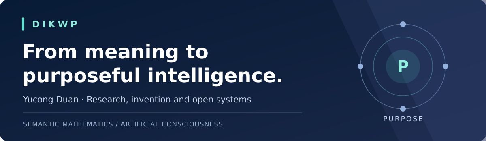

[English](README.md) · [中文](README.zh-CN.md) · [Español](README.es.md) · [Français](README.fr.md) · [العربية](README.ar.md) · [日本語](README.ja.md) · [हिन्दी](README.hi.md) · [Italiano](README.it.md) · [Deutsch](README.de.md) · [Ελληνικά](README.el.md) · [한국어](README.ko.md) · [Čeština](README.cs.md) · [Tiếng Việt](README.vi.md)

# يوكونغ دوان · Yucong Duan · 段玉聪

### ذكاء موجّه بالغاية. بحث مفتوح للفهم والبناء.

يبحث يوكونغ دوان في رسوم DIKWP البيانية والوعي الاصطناعي والرياضيات الدلالية والذكاء الاصطناعي القابل للتدقيق. يربط برنامجه بين النظرية والابتكار والمنشورات والأنظمة المفتوحة.

**487 مستودعاً عاماً · 12 مجالاً بحثياً · 13 لغة**

يرمز DIKWP إلى البيانات والمعلومات والمعرفة والحكمة والغاية. تشكّل هذه الموارد شبكة من التحولات؛ فالغاية توجّه التفسير، ويمكن مراجعتها أيضاً.

| | |
|---|---|
| **استكشاف البحث** | [DIKWP · Research brief](RESEARCH_BRIEF.md) |
| **الأثر والمصادر** | [ISO/IEC · CAAI · International research](IMPACT.md) |
| **الروابط الصناعية وفرص التعاون** | [Industry connections](INDUSTRY_CONNECTIONS.md) |
| **الكتب والمنشورات** | [Books · Papers · ISBN](PUBLICATIONS.md) |
| **التجربة الأولى** | [PACT](START_HERE.md#run-your-first-experiment) · [MESH²](https://github.com/YucongDuan/DIKWP-MESH-) |
| **الدليل الكامل** | [487 repositories](REPOSITORY_DIRECTORY.md) |
| **التعاون** | [Written research proposals](COLLABORATE.md) |

**ASCENT 0.2** · [Research console](https://github.com/YucongDuan/DIKWP-ASCENT-v0.2.0)

**PRAXIS WorldGate 2.0** · [Evidence, authority and action](https://github.com/YucongDuan/DIKWP-PRAXIS-WorldGate-v2.0.0)

**ابدأ بسؤال يستحق البحث. أرسل مقترحاً مكتوباً، أو أعد تنفيذ تجربة، أو ساهم في مشروع.**

[Official website](https://www.yucongduan.org/) · [ResearchGate](https://www.researchgate.net/profile/Yucong-Duan) · [Google Scholar](https://scholar.google.com/citations?user=Px89gSoAAAAJ&hl=en) · [DBLP](https://dblp.org/pid/10/2092.html) · [WAAC](https://waac.ac/)

تحديث 16 سبتمبر 2026. تتوفر الملفات التفصيلية بالإنجليزية والصينية.

[الملف التفصيلي السابق · 2026-09-08](archive/2026-09-08/README.ar.md)
