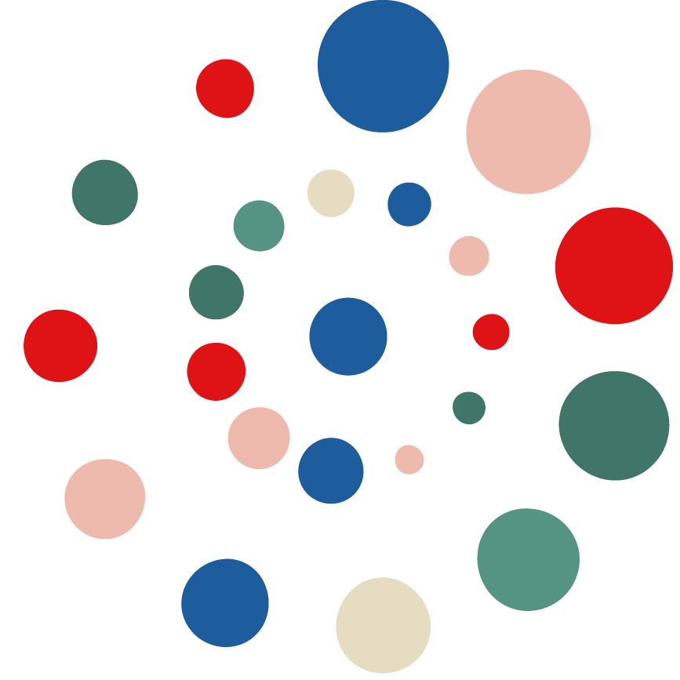

**[English](README.md) · [中文](README.zh-CN.md) · [Español](README.es.md) · [Français](README.fr.md) · [العربية](README.ar.md) · [日本語](README.ja.md) · [हिन्दी](README.hi.md) · [Italiano](README.it.md) · [Deutsch](README.de.md) · [Ελληνικά](README.el.md) · [한국어](README.ko.md) · [Čeština](README.cs.md) · [Tiếng Việt](README.vi.md)**

# 段玉聪 · Yucong Duan

### DIKW／DIKWP 图谱化 · 人工意识 · 语义数学 · 可审计人工智能

海南大学教授、博士生导师 · 世界人工意识协会（WACA）主席 · 世界人工意识科学院（WAAC）首任院长

[进入十三语研究主页](https://yucong-duan-research.dikwp407.chatgpt.site) · [Google Scholar](https://scholar.google.com/citations?user=Px89gSoAAAAJ&hl=en) · [DBLP](https://dblp.org/pid/10/2092.html) · [专利布局图](PATENT_PORTFOLIO_MAP.md) · [证据地图](DIKWP_EVIDENCE_MAP.md)

## GPT-6 Astra 发布后：研究问题已超越“模型够不够强”

OpenAI 于 [2026 年 9 月 3 日发布 GPT-6 Astra](https://openai.com/index/gpt-6-astra/)，强调其在编程、研究、计算机操作与复杂多步任务上的提升。当前沿模型变得更强、更具智能体能力时，真正有区分度的问题不再只是“模型能否完成任务”，还包括：

| GPT-6 时代的关键要求 | DIKWP 研究回应 |
|---|---|
| **受治理智能体** | 说明服务谁的目的、具有什么权限、经过哪些门禁，以及如何暂停或撤回行动。 |
| **携带证据的轨迹** | 保留数据、信息、知识、价值判断、目的、来源与转换损失，而不是只输出一个不透明答案。 |
| **现实接触测评** | 检查意图识别、工具使用、不确定性、结果、纠错与模型修订，而非只看单一排行榜分数。 |
| **共同支持基础设施** | 通过公共 Port、证据地图、专利架构与互联仓库生态，让研究能由更多人质疑、维护、翻译并继续推进。 |

[查看 OpenAI 官方发布页 →](https://openai.com/index/gpt-6-astra/) · [查看官方系统卡 →](https://deploymentsafety.openai.com/gpt-6-astra)

> **证据边界：** OpenAI 页面能够证明 GPT-6 Astra 的发布及部署安全记录；不能据此推出 OpenAI 与 DIKWP 存在合作、采用或背书关系。上表属于本研究体系对 GPT-6 后时代的战略解释。

## 从语义资源走向可检查系统

段玉聪的研究把数据、信息、知识、智慧与目的（DIKWP）建模为相互区别、可以转换的语义资源，并致力于让这些转换可见、可检验、可修订、可问责。其原创研究主线较早并系统性地把知识图谱扩展为类型化、可计算的 DIKW／DIKWP 图谱，并进一步连接人工意识、主动医学、语义主权、语义数学与 DIKWP 白盒测评。

> 工作闭环：D → I → K → W → P → 行动 → 证据 → 修订

**GitHub 公开快照（2026-09-07）：480 个公开仓库、1,318 个可见 Stars、740 位关注者。** 全量索引记录 456 条 GitHub 公开描述；当公开元数据为空时，互联图采用有边界的仓库文档范围摘要。时间戳数据不是永久总数，也不是质量评分。

### 480 仓库 × 十二研究星座

全部仓库现已按主要研究问题分类，并各自获得至少 5 条双向关联；全图共 **1,556 条**“语义内核、同域节点、研究连续性、跨域桥接”关系。**Portfolio architecture:** DIKWP Foundations & Semantic Architecture (139) · Artificial Consciousness & Digital Life (71) · Evidence, Evaluation & AI Governance (80) · Education, Work & Human Capability (44) · Semantic Mathematics & Formal Proof (36) · Medicine, Health & Care (31) · Economy, Value & Investment (20) · Memory, Identity & Personal Systems (21) · Society, Civilization & Public Infrastructure (12) · Standards, Interoperability & Research Translation (11) · Security, Justice & Resilience (9) · Physics, Cosmos & Fundamental Inquiry (6).

9 月 6 日新增套件聚焦四条轴线：视觉与心血管照护 Commons；TrueValue／主动经济；公共转型与现实清算；共生成与模型内驻数字生命。连同 Cognitive State Equation Lab、POLYMIND、AUTONOMOUS PERSONA NOESIS、OPENCONSTELLATION、RepoProof OS 与 PERSONA NOESIS CONTINUUM，共形成相较 449 仓库检查点的 27 项增量。

[浏览全部 480 个仓库与 1,556 条双向关联 →](https://yucong-duan-research.dikwp407.chatgpt.site/repository-ecosystem)

<!-- engineering-update-2026-09-07:start -->
## 源码、测试与复现

检查源码，重跑实验，并把证据追溯到实际发布的版本。 **核验日期: 2026-09-07 · 已复现重点项目: 3.**

[打开工程目录](https://yucong-duan-research.dikwp407.chatgpt.site/source-catalog/index.html) · [查看迁移记录](ENGINEERING_STATUS.md) · [公开仓库: 480](REPOSITORY_ECOSYSTEM_480.md) · [JSON](REPOSITORY_ECOSYSTEM_480.json)

| Project | 证据与边界 | 已发布并检查 |
|---|---|---|
| [VerityWeave v2](https://github.com/YucongDuan/DIKWP-VERITYWEAVE-v2.0.0) | 以运行时验证替代无条件不变量声明；检查篡改输出、行动门控和缺失的复核通道，外部执行保障仍标记为未核验。 | [查看自动检查](https://github.com/YucongDuan/DIKWP-VERITYWEAVE-v2.0.0/actions/runs/34084362258) · [公开版本 acb576c](https://github.com/YucongDuan/DIKWP-VERITYWEAVE-v2.0.0/commit/acb576c6e2559f1ad792fa93e5cb8364aaad1f64) |
| [PACT v0.1](https://github.com/YucongDuan/DIKWP-PACT-v0.1.0) | 源码、测试与示例可直接浏览；重新运行 72 个合成场景和 4 个基线，与记录结果比对。 | [查看自动检查](https://github.com/YucongDuan/DIKWP-PACT-v0.1.0/actions/runs/34084517968) · [公开版本 966c5df](https://github.com/YucongDuan/DIKWP-PACT-v0.1.0/commit/966c5dfd11ea1a372331072a34d406494a37153b) |
| [MESH2](https://github.com/YucongDuan/DIKWP-MESH-) | 补齐语义网络原型缺失的 SciPy 依赖，重做分析与产物生成，核对数值并运行层级反例。 | [查看自动检查](https://github.com/YucongDuan/DIKWP-MESH-/actions/runs/34084402083) · [公开版本 c7a6947](https://github.com/YucongDuan/DIKWP-MESH-/commit/c7a6947b66f5227141d92905cf23e6c4b0a8e50e) |

源码可见、测试通过与有界模型检查各有范围，不能据此推定独立采用、认证或现实有效性。

NOT_VERIFIED 表示本次测试尚未确立该主张，不能显示为通过。

欢迎提交复现报告、失败案例或范围明确的改进。

<!-- engineering-update-2026-09-07:end -->

<!-- research-update-2026-09-07:start -->
## 独立学术引用与政策采用

本次于 2026-09-07 核验补入，保留各项真实发表日期；这里的“新增”指主页新收录，不表示文献刚刚发表。

- [Digital Sovereignty Means Breaking the Western Monopoly on AI Meaning](https://www.techpolicy.press/digital-sovereignty-means-breaking-the-western-monopoly-on-ai-meaning/) — Sujata Mukherjee; Sasha Maria Mathew; Upwork; Bumble; 2026-04-28. 独立作者政策文章直接链接段玉聪语义主权研究及 Fan—Duan 目的计算章节，将 DIKWP 用于语言平权和社群主导的 AI 安全治理讨论。 属于作者层面的政策理论采用。出版方所列 Upwork、Bumble 任职背景，不等同于这些公司的采用、背书或系统部署。
- [Unlocking the Code of Innovation: TRIZ Theory’s Blueprint for Precision Medicine Breakthroughs](https://link.springer.com/chapter/10.1007/978-3-031-77302-0_1) — Rudi Schmidt; IHLAD Abu Dhabi; 2025-03-11. Schmidt 的精准医学章节在 AI 辅助患者分组与发明原理选择的展望中，直接引用 Wu 与 Duan 的 DIKWP-TRIZ 研究。 属于可核验的跨领域引用与概念讨论，不能据此推出 DIKWP 已进入临床部署、改善患者结局或得到医学验证。
- [Overview of Artificial General Intelligence (AGI)](https://link.springer.com/chapter/10.1007/978-981-97-3222-7_1) — Oroos Arshi; Aryan Chaudhary; University of Petroleum and Energy Studies; Bio-Tech Sphere Research; 2025 book; online 2024-08-31. 该 AGI 概述的出版社公开参考文献列入两项 Li—Duan 研究，分别涉及 DIKWP 伦理表现与 GPT-4 测评，显示其进入更广泛的 AGI 安全讨论。 已核验公开参考文献，章节全文需订阅；公开材料不足以证明方法实施或独立复现实验。

ISO 官方参考文献第 22 项还直接引用 Wu—Duan 的 DIKWP 不确定性研究；负责委员会为 **ISO/IEC JTC 1**，文献类型为**技术报告（Technical Report）**。[官方参考文献](https://www.iso.org/obp/ui?_escaped_fragment_=iso:std:iso-iec:tr:25005:-2:ed-1:v1:en)。

[阅读中英文证据报告](RESEARCH_ENRICHMENT_2026-09-07.md) · [DOI / metadata](RESEARCH_ENRICHMENT_2026-09-07.json)

<!-- research-update-2026-09-07:end -->

### 6 September 2026 · eight-repository suite · English international summary

[VerityWeave v2](https://github.com/YucongDuan/DIKWP-VERITYWEAVE-v2.0.0) · [Qingyuan OS v1](https://github.com/YucongDuan/DIKWP-QINGYUAN-OS-v1.0.0) · [Qingyuan OS v2](https://github.com/YucongDuan/DIKWP-QINGYUAN-OS-v2.0.0) · [Cognitive Immune Qingyuan 27](https://github.com/YucongDuan/DIKWP-COGNITIVE-IMMUNE-QINGYUAN-27.0.0) · [Semantic Immunity Repair](https://github.com/YucongDuan/DIKWP-SEMANTIC-IMMUNITY-REPAIR-v1.0.0) · [Essence Omega OS](https://github.com/YucongDuan/DIKWP-ESSENCE-OMEGA-OS-v1.0.0) · [Ultimate Essence BENYUAN](https://github.com/YucongDuan/DIKWP-ULTIMATE-ESSENCE-BENYUAN-26.0.0) · [DuanLife Open Autonomy 15](https://github.com/YucongDuan/DIKWP-DUANLIFE-OPEN-AUTONOMY-15-v3.0.0)

The public source-import workflows completed successfully, and the prepared source trees passed **512 local tests** in aggregate. The suite connects semantic resilience, cognitive immunity, falsifiable essence, semantic closure and governed artificial life. This establishes source availability and local verification only—not independent validation, adoption, production fitness, consciousness, personhood or metaphysical truth.

> 证据边界：仓库页面证明源码公开与项目自述范围，不单独证明外部验证、现实部署、临床或金融有效性、正式标准化、背书或代理他人行动的权限。

## 两个研究与实践端口

| 端口 | 主要路径 |
|---|---|
| [**DIKW／DIKWP 公共学术与实践 Port**](https://yucong-duan-research.dikwp407.chatgpt.site/dikwp-port) | 理论与图谱 → 标准与证据 → 专利与战略申请 → 开放工程 → 跨领域实践。 |
| [**人工意识研究与试验公共 Port**](https://yucong-duan-research.dikwp407.chatgpt.site/consciousness-port) | 理论与国际分类 → 白盒测评 → 开放试验与智能体 → 医学、伦理、法律及机构协作。 |

## 2026 年 8 月新增

- 新增 LETI 的独立 Quality 4.0 学术应用，明确区分学术复用与机构整体采用。
- 新增 DIKWP-MESH 8.0、DIKWP-SAIL、BASSK、DIKWP-Ω 与 OPENBECOMING84 等研究发布。
- 新增 DIKWP-EXPERION 9.3、DIKWP-METALIFE 9.3、DIKWP-ORBIT 92、OmniMemory OS 与 OMEGA-ACOS 等可运行系统。
- 新增 6 组中英文 ResearchGate 研究著作缩略图；缩略图明确标为研究版，不冒充出版社正式封面。
- 新增 [DBLP 十年书目主轴](https://dblp.org/pid/10/2092.html)：可见标签覆盖 62 条期刊、128 条会议／工作坊及 10 条非正式／其他记录；这些是书目覆盖，不等同于引用影响力。
- 新增 CNKI 精选脉络：从《软件学报》模型驱动方法，到跨模态隐私治理、DIKWP 人机融合、民族医学与意图生命周期；均标明“源头团队成果”边界。

## 关键影响力入口

- [ISO/IEC TR 25005-2:2025](https://www.iso.org/standard/86195.html)：DIKWPA 被用于智慧城市数据利用案例分析与数据价值链基础。
- [中国人工智能学会《人工智能基础选编》](https://www.caai.cn/index.php?s=/home/article/detail/id/4375.html)：第一章系统展开 DIKWP，第二章讨论人工智能、人工意识及其与 DIKWP 的关系。
- [Google Scholar](https://scholar.google.com/citations?user=Px89gSoAAAAJ&hl=en)：论文、引用与合作网络。
- [WAAC](https://waac.ac/) 与 [yucongduan.org](https://www.yucongduan.org/)：人工意识机构、院士网络、历届大会与研究动态。
- [YouTube](https://www.youtube.com/@yucongduan)、[DIKWP-AC](https://www.youtube.com/@DIKWP-AC/videos) 与 [LinkedIn](https://www.linkedin.com/in/yucong-duan-b63a4648/)：视频档案与国际交流。

## 专利布局

经所提供材料核验：2017—2023 基础批次可解析为 **115 条结构化记录**；2025 批次包含 **139 项发明条目**，覆盖法律与语义主权（29）、主动医学与健康（27）、人工意识（21）、DIKWP 核心图谱与语义数学（21）、教育与创造力（17）、白盒可信 AI（12）、多智能体与数字基础设施（12）。

[查看完整专利布局、代表性标题与统计边界 →](PATENT_PORTFOLIO_MAP.md)

> 115 + 139 = 254 是两批材料的源记录数，不等同于官方专利总数、授权数、去重法律同族数或当前法律状态。

## 从代码开始

[DIKWP AgentTrace OS](https://github.com/YucongDuan/DIKWP-AgentTrace-OS) · [DIKWP ProofLedger OS](https://github.com/YucongDuan/DIKWP-ProofLedger-OS) · [LLM WhiteBox EvalLab](https://github.com/YucongDuan/DIKWP-LLM-WhiteBox-EvalLab-V1) · [Consciousness Futures Studio](https://github.com/YucongDuan/DIKWP-Consciousness-Futures-Studio-V1) · [全部仓库](https://github.com/YucongDuan?tab=repositories)
